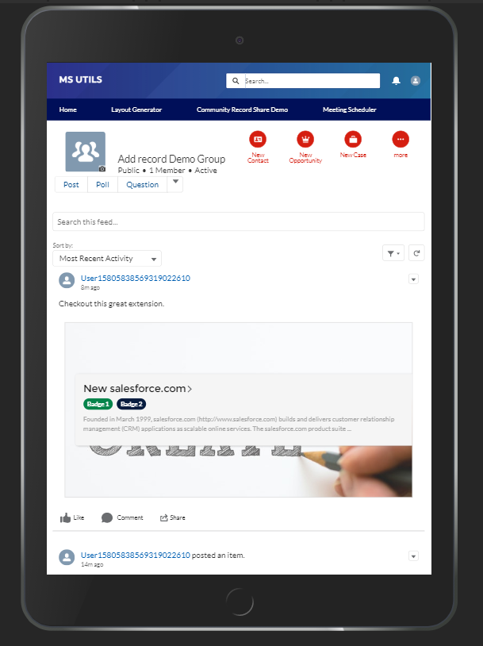

# Community record share
Community record share is a chatter extension/ rich publisher application which enhances the feed in salesforce communities. 

Features: 

 1. Available for 
		- Groups
		- Topics
		- Direct messages
2. Allows configuration of different records to be shared, search configurations and complete control over content to be shown
3. CSS hooks to style component to match you community. 

# Install
The latest version is Butterfly 2020 v2.5 and can be installed as a managed package [here](https://login.salesforce.com/packaging/installPackage.apexp?p0=04t2w000009BUY8)
The managed package has following components. 

| **Package Components**                         	|                                   	|                                	|
|--------------------------------------------	|-----------------------------------	|--------------------------------	|
|                                            	|                                   	|                                	|
| **Fields (7)**                                 	|                                   	|                                	|
| Component Name                             	| Parent Object                     	| Component Type                 	|
| Object Api Name                            	| Share Dialog Search Configuration 	| Custom Field                   	|
| Records to Show                            	| Share Dialog Search Configuration 	| Custom Field                   	|
| Title Field                                	| Share Dialog Search Configuration 	| Custom Field                   	|
| Object Display Name                        	| Share Dialog Search Configuration 	| Custom Field                   	|
| Subtitle Field                             	| Share Dialog Search Configuration 	| Custom Field                   	|
| Selected Record Data Provider              	| Share Dialog Search Configuration 	| Custom Field                   	|
| Icon Name                                  	| Share Dialog Search Configuration 	| Custom Field                   	|
|                                            	|                                   	|                                	|
| **Aura/LWC Components**                                 	|                                   	|                                	|
| Component Name                             	| Parent Object                     	| Component Type                 	|
| shareDialogCompose                         	|                                   	| Aura Component Bundle          	|
| shareDialogRender                          	|                                   	| Aura Component Bundle          	|
| recordDisplay                              	|                                   	| Lightning Web Component Bundle 	|
| polyLookup                                 	|                                   	| Lightning Web Component Bundle 	|
|                                            	|                                   	|                                	|
| **Objects (1)**                                	|                                   	|                                	|
| Component Name                             	| Parent Object                     	| Component Type                 	|
| Share Dialog Search Configuration          	|                                   	| Custom Metadata Type           	|
|                                            	|                                   	|                                	|
| **Resources (3)**                              	|                                   	|                                	|
| Component Name                             	| Parent Object                     	| Component Type                 	|
| Share Dialog Configuration Layout          	| Share Dialog Search Configuration 	| Page Layout                    	|
| ShareRecordIcon                            	|                                   	| Asset File                     	|
| ShareRecord                                	|                                   	| Chatter Extension              	|
|                                            	|                                   	|                                	|
| **Permission Sets (1)**                        	|                                   	|                                	|
| Component Name                             	| Parent Object                     	| Component Type                 	|
| Record Share Chatter Extension Permissions 	|                                   	| Permission Set                 	|
|                                            	|                                   	|                                	|
| **Code (6)**                                   	|                                   	|                                	|
| Component Name                             	| Parent Object                     	| Component Type                 	|
| PolyLookupController                       	|                                   	| Apex Class                     	|
| PolyLookupControllerTest                   	|                                   	| Apex Class                     	|
| PolyLookupWrappers                         	|                                   	| Apex Class                     	|
| RecordShare                                	|                                   	| Apex Class                     	|
| PolyLookupHelper                           	|                                   	| Apex Class                     	|
| RecordShareTest                            	|                                   	| Apex Class                     	|

# PostInstall
#### Configure objects

Goto Custom metadata an add configuration settings


#### Provide an implementation for record share. 

To return results, create a class that implement Callable write an
implementation of method an provide the actual results

Example Implementation:

Add `RecordShareDataProvider` class name in `DataProvider__c` field in
Share Record metadata

###### **Example class implementation (GLOBAL CLASS)**

```
/*------------------------------------------------------------------------------
 - Copyright (C)  2020 Manjit Singh
 -
 - Created By: Manjit Singh (www.manjitsingh.dev)
 -
 -
 -                                Modification log:
 -             Dates are in DD/MM/YYYY Format unless specified otherwise.
 -  ==========================================================
 -  S.No.        Name            Date           Change Details
 -  1.          Manjit Singh    15/9/2020          Created.
 -----------------------------------------------------------------------------*/


global with sharing class RecordShareImplementation implements Callable {

public Object call(String method, Map<String, Object> parameters) {
        gmsd.RecordShare.Result result = new gmsd.RecordShare.Result();
        if (method == 'getRecordDetails') {
            result.badges = new List< gmsd.RecordShare.Badge>();
            result.badges.add(new  gmsd.RecordShare.Badge('Badge 1', 'slds-theme_success'));
            result.badges.add(new  gmsd.RecordShare.Badge('Badge 2', 'slds-theme_inverse'));

            String recordId = (String) parameters.get('recordId');
            if (String.isNotBlank(recordId)) {
                Account acc = [
                        SELECT Id, Name, Description, CreatedBy.Name, CreatedDate
                        FROM Account
                        WHERE Id = :recordId
                        LIMIT 1
                ];
                result.createdBy = acc.CreatedBy.Name;
                result.createdDate = acc.CreatedDate;
                result.subTitle = acc.Description;
                result.title = acc.Name;
                result.imageUrl = 'https://images.pexels.com/photos/316465/pexels-photo-316465.jpeg?crop=entropy&cs=srgb&dl=pexels-lumn-316465.jpg&fit=crop&fm=jpg&h=426&w=640';
                result.id = acc.Id;
                //result.error = new gmsd.RecordShare.Error(true, 'Hello manjit','slds-theme_offline');
            }
        }
        return result;
    }
}
```

The result class

1.  String id =&gt; Id of the record
2.  String title =&gt; title to be shown
3.  String subTitle =&gt; Subtitle of the results
4.  String imageUrl =&gt; URL of the image
5.  List&lt;Badge&gt; badges having label, styleClass, iconName as
    `String` types
 6. Error => error object.  

### Methods
The implementation provides two methods that can be utilized to create a feed post or a direct message. These methods create the skeleton that can be post by using:
`ConnectApi.ChatterFeeds.postFeedElement({communityId}, feedElement);`

*Community/Network Id is required for extension*

##### 1. getPrivateMessageSkeleton()

Call this method when you want to post a direct message with extension attached. The element can be manipulated to add additional
capabilities.  
  
Use the `setInput` instance method to provide an input of
`recordShare.Message` class and then call this method.

**Class definition**

     class RecordShare.Message {
         String communityId;
         String subject;
         List<Id> parentOrMemberIds;
         String sharedRecordId;
         String message;
     }
     
Example: 

    gmsd.RecordShare.Message input = new gmsd.RecordShare.Message();  
    input.message = 'Hello Body!';  
    input.subject = 'Hello Subject!';  // Only used in case of a direct message
    input.parentOrMemberIds = new List<Id>{  
            '0056g000003mue0AAA'  // In case of Direct message this would be list of users else parent Id in case of feed post.
    };  
    input.communityId = '0DBXXXXXXXXXX';  
    input.sharedRecordId = '001XXXXXXXXXXX';  
    gmsd.RecordShare share = new gmsd.RecordShare();  
      
    ConnectApi.ChatterFeeds.postFeedElement(input.communityId, share.setInput(input).getPrivateMessageSkeleton());

##### 2. getFeedSkeleton
Use this method for feed post.
Example: 

    ConnectApi.ChatterFeeds.postFeedElement(input.communityId, share.setInput(input).getPrivateMessageSkeleton());

## Screenshots/Videos: 

Configuration



